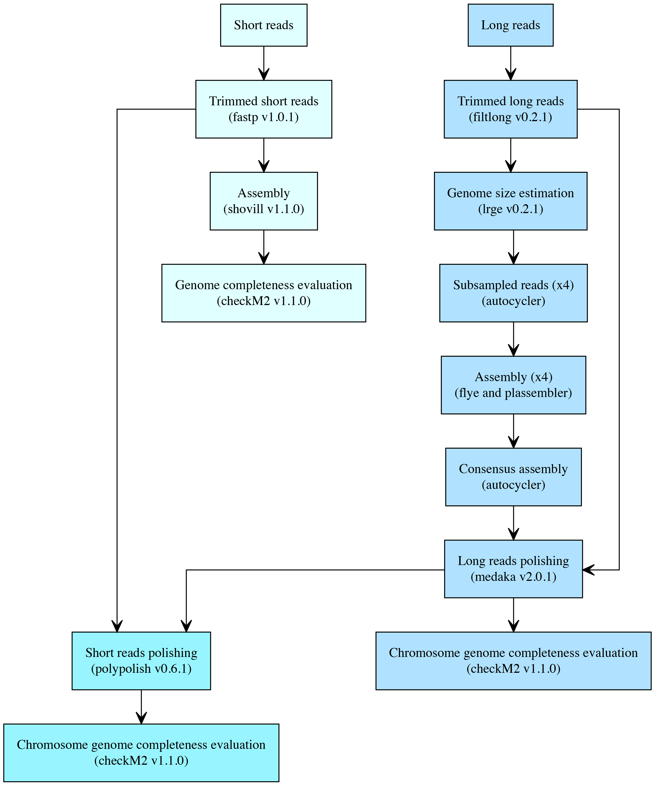

# VTGenomeAssembly (VTGA)

VTGA is a Snakemake workflow designed to assemble bacterial genome using Illumina short and/or Nanopore long reads.

## Workflow

<p align="center">
    
</p>

- **Short reads only**: Short reads are trimmed with [fastp](https://github.com/OpenGene/fastp) and assembled with [shovill](https://github.com/tseemann/shovill) (using [spades](https://github.com/ablab/spades) by default). Contigs <1kb are excluded from the final assembly, and genome quality is assessed using [CheckM2](https://github.com/chklovski/CheckM2).
- **Long reads only**: Long reads shorter than 1kb and the worst 5% of reads are removed using [filtlong](https://github.com/rrwick/Filtlong). The trimmed reads are subsampled into four files by default using [autocycler](https://github.com/rrwick/Autocycler/wiki/Autocycler-subsample). Each subset is assembled with [flye](https://github.com/mikolmogorov/Flye) and [plassembler](https://github.com/gbouras13/plassembler), respectively. The resulting assemblies are merged to generate a high-confidence consensus assembly using autocycler. The assembly is then polished using [medaka](https://github.com/nanoporetech/medaka) with the long reads. The chromosome genome quality is evaluated using [CheckM2](https://github.com/chklovski/CheckM2).
- **Hybrid reads**: The hybrid reads workflow is largely the same as using long reads only, except that additional polishing is performed using [Polypolish](https://github.com/rrwick/Polypolish) with the short reads. 

The softwares and versions used for each step are listed in parenthesis. The versions for autocycler, flye and plassembler can be found in the output file `long_reads_only/software_versions.txt`.

## Set up environment

### Clone the repository 

```bash
git clone https://github.com/xwu35/vtga.git
```

### Install Snakemake

VTGA is built for Snakemake version 7. Version 8 and above introduce breaking changes and deprecations and have not been tested. It may not function correctly with newer versions. Please install Snakemake version 7 using the script below.

```bash
# option 1 using conda
conda env create -n snakemake -f vtga/snakemake_env.yml

# option 2 using mamba if it's installed
mamba env create -n snakemake -f vtga/snakemake_env.yml
```

If you have installed Snakemake version 7 on your system without using the commands above, make sure that Biopython is also installed. If it is not already installed, activate your snakemake environment and run `pip install biopython==1.86`.

### Download snakemake profile

The profile is required to run the workflow on HPC. Skip this step if you already have a SLURM profile in `~/.config/snakemake`.

```bash
# download the profile
git clone https://github.com/xwu35/slurm

# move the profile to the right directory
mv slurm ~/.config/snakemake 
```

### Export PATH

Add the vtga path to your environment variable so you can run `vtga.py` without the full path.

```bash
echo 'export PATH="/your/path/to/vtga:$PATH"' >> ~/.bashrc
```

To make the changes take effect, you can either log out and log back in, or you can source the `.bashrc` file using the following command:

```bash
source ~/.bashrc
```

## Genome information table

The input table for hybrid-read assemblies must contain four columns: genome, short_R1, short_R2, long_reads. For short-read only assemblies, the long column is not required. Conversely, for long-read only assemblies, the short_R1 and short_R2 columns are not required.'

| sample     | short_R1                          | short_R2                          | long_reads                     |
|------------|-----------------------------------|-----------------------------------|--------------------------------|
| ecoli_702  | 8VYL65_2_281_illumina_R1.fastq.gz | 8VYL65_2_281_illumina_R2.fastq.gz | 8VYL65_2_281_nanopore.fastq.gz |
| ecoli_3206 | 8VYL65_7_299_illumina_R1.fastq.gz | 8VYL65_7_299_illumina_R2.fastq.gz | 8VYL65_7_299_nanopore.fastq.gz |
| ecoli_5803 | 8VYL65_5_284_illumina_R1.fastq.gz | 8VYL65_5_284_illumina_R2.fastq.gz | 8VYL65_5_284_nanopore.fastq.gz |
| ecoli_5802 | 8VYL65_4_283_illumina_R1.fastq.gz | 8VYL65_4_283_illumina_R2.fastq.gz | 8VYL65_4_283_nanopore.fastq.gz |

## Usage

VTGA supports both short and long reads assembly, with hybrid used by default. Detailed usage information can be viewed using the -h or --help flags `vtga.py -h`. 

Do not run the analysis on the login node. Submit it as a sbatch job. See `run_vtga.sh` for an example, or check the HTCF usage guide here (https://github.com/xwu35/baldridge_lab/blob/main/HTCF.md). 

A dry-run can be performed to check which rules will be executed and which files will be produced by specifying `--dryrun`.

If you did not export the path as shown above, you will need to specify the full path to `vtga.py`.

```bash
conda activate snakemake

# hybrid reads by default
vtga.py \
    --reads_dir /path/to/raw_reads/directory \
    --genome_info /path/to/genome/information/table \
    -o output_dir 

# short reads only
vtga.py \
    --reads_dir /path/to/raw_reads/directory \
    --genome_info /path/to/genome/information/table \
    -o output_dir \
    --reads_type short

# long reads only
vtga.py \
    --reads_dir /path/to/raw_reads/directory \
    --genome_info /path/to/genome/information/table \
    --reads_type long
```

Options:

```
$ vtga.py -h

Usage: vtga.py --reads_dir <reads directory> --genome_info <genome information table> -o <output directory>

Options:
  --reads_dir PATH       Reads directory  [required]
  --genome_info FILE     Genome information table (tab separated). 
                         The input table for hybrid-read assemblies must contain four columns: 
                         genome, short_R1, short_R2, long_reads. 
                         For short-read only assemblies, the long column is not required. 
                         For long-read only assemblies, the short_R1 and short_R2 columns are not required.  [required]
  -o, --output_dir PATH  Output directory  [default: OUTPUT]
  --reads_type TEXT      Reads type; available options are: short, long, hybrid  [default: hybrid]
  --count INTEGER        Number of subgenomed read sets. This option only applies when long reads are provided  [default: 4]
  --dryrun               Check rules to run and files to produce
  --conda_envs TEXT      Directory to store conda environments. By default, the "conda_env" directory within vtga is used  [default: ""]
  --profile TEXT         Snakemake profile for cluster execution  [default: slurm]
  -v, --version          Show the version and exit.
  -h, --help             Show this message and exit.
```

## Output file description

| Reads type |                                      Filename                                         |                            Description                          |
|------------|---------------------------------------------------------------------------------------|-----------------------------------------------------------------|
| Short      | `short_reads_only/genome_sequences/{genome_name}_contigs.fa`                                        | The final assembly you should use                               |
| Short      | `short_reads_only/intermediate/shovill_output/{genome_name}/spades.fasta`                           | Raw assembled contigs (spades)                                  |
| Short      | `short_reads_only/genome_quality/{genome_name}/quality_report.tsv`                                  | Genome quality report                                           |
| Long       | `long_reads_only/genome_sequences/{genome_name}_consensus.fasta`                                    | The final assembly containing chromosome and plasmid sequences  |
| Long       | `long_reads_only/genome_sequences/{genome_name}_chromosome_genome.fasta`                            | The extracted chromosome genome sequences                       |
| Long       | `long_reads_only/genome_quality/{genome_name}/quality_report.tsv`                                   | Chromosome genome quality report                                |
| Hybrid     | `long_reads_plus_short_reads_polished/genome_sequences/{genome_name}_short_reads_polished.fasta`    | The final assembly containing chromosome and plasmid sequences  |
| Hybrid     | `long_reads_plus_short_reads_polished/genome_sequences/{genome_name}_chromosome_genome.fasta`       | The extracted chromosome genome sequences                       |
| Hybrid     | `long_reads_plus_short_reads_polished/genome_quality/{genome_name}/quality_report.tsv`              | Chromosome genome quality report                                |
 	